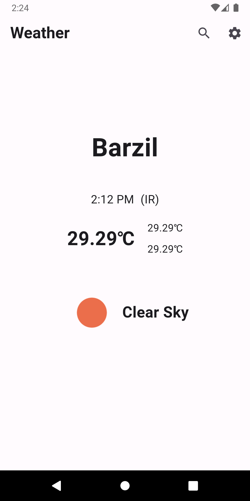
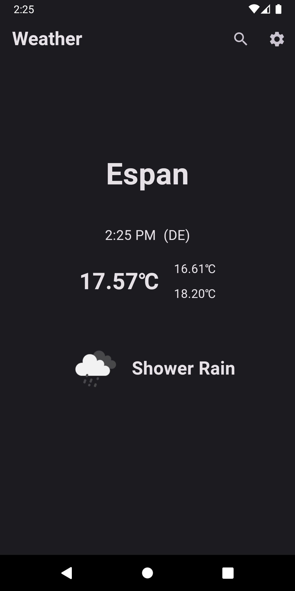
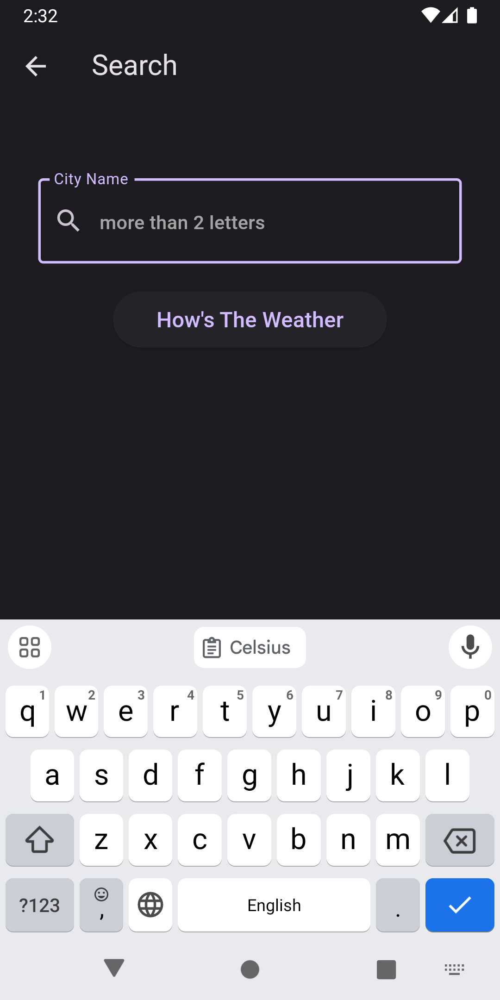
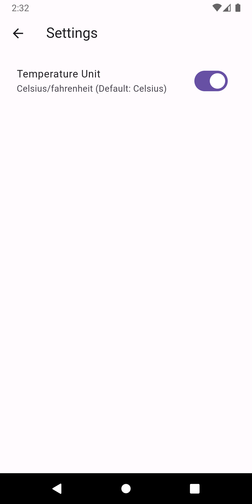

# weather

# weather App

is an app used to fetch weather from openWeatherMap api and display different themes depending on weather degree 

as you can search for city and get weather and toggled between show degree in Celsius or fahrenheit

the is made with different type of logic as it made in :

 - cubit + streamSubscription
 - cubit + BlocListener
 - Bloc + StreamSubscription
 - Bloc + BlocListener

